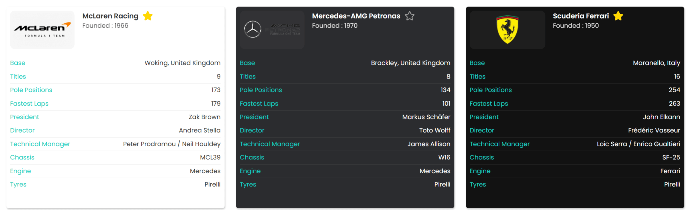
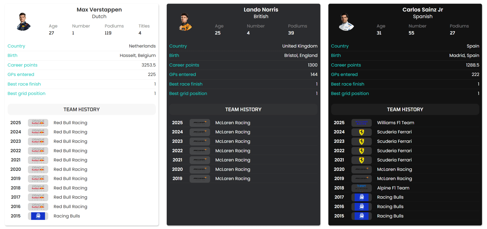

# Widgets Dedicados

Os widgets dedicados são especializados para esportes específicos que possuem estruturas e informações únicas.

---

## Formula-1

O widget de Formula 1 permite que você acompanhe a temporada de F1 do início ao fim. Desde sessões de treino e classificação até sprints e a corrida principal, cada Grande Prêmio pode ser acompanhado em detalhes.

Cada evento inclui classificações completas, volta mais rápida, grid de largada e pit stops. Também fornece classificações de pilotos e times, oferecendo uma visão clara da temporada atual.

### Widget: Races (Corridas)

Lista de todas as corridas de Formula 1 disponíveis para a temporada selecionada.


#### Parâmetros:

| Parâmetro | Tipo | Obrigatório | Padrão | Valores | Descrição |
|-----------|------|-------------|--------|---------|-----------|
| `data-type` | string | ✅ | - | - | Deve ser `races` |
| `data-season` | integer | ❌ | última temporada | YYYY | Define qual temporada exibir |
| `data-tab` | string | ❌ | primeira com dados | `"all"`, `"live"`, `"finished"`, `"scheduled"` | Aba a selecionar quando o widget abre |
| `data-rankings` | boolean | ❌ | `false` | `true`, `false` | Habilita rankings no widget |
| `data-target-race` | string | ❌ | - | - | Define onde exibir detalhes da corrida (`modal` ou seletor CSS) |

#### Exemplos:

**Exemplo Mínimo:**
```html
<anymal-widget
  data-type="config"
  data-key="Anymal"
  data-sport="f1"
></anymal-widget>

<anymal-widget
  data-type="races"
></anymal-widget>
```

**Com Aba "Ao Vivo" Selecionada:**
```html
<anymal-widget
  data-type="races"
  data-tab="live"
></anymal-widget>
```

**Com Rankings Habilitados:**
```html
<anymal-widget
  data-type="races"
  data-rankings="true"
></anymal-widget>
```

**Com Target para Modal:**
```html
<anymal-widget data-type="races"></anymal-widget>

<anymal-widget
  data-type="config"
  data-key="Anymal"
  data-sport="f1"
  data-target-race="modal"
></anymal-widget>
```

---

### Widget: Race (Detalhes da Corrida)

Exibe detalhes completos de uma corrida de Formula 1: resultados, tempos e pódio.


#### Parâmetros:

| Parâmetro | Tipo | Obrigatório | Padrão | Valores | Descrição |
|-----------|------|-------------|--------|---------|-----------|
| `data-type` | string | ✅ | - | - | Deve ser `race` |
| `data-race-id` | integer | ✅ | - | - | ID da corrida |
| `data-rankings` | boolean | ❌ | `false` | `true`, `false` | Habilita aba de **rankings** |
| `data-fastest-laps` | boolean | ❌ | `false` | `true`, `false` | Habilita aba de **voltas mais rápidas** |
| `data-starting-grid` | boolean | ❌ | `false` | `true`, `false` | Habilita aba de **grid de largada** |
| `data-pit-stops` | boolean | ❌ | `false` | `true`, `false` | Habilita aba de **pit stops** |
| `data-target-driver` | string | ❌ | - | - | Define onde exibir detalhes do piloto (`modal` ou seletor CSS) |

#### Exemplos:

**Exemplo Mínimo:**
```html
<anymal-widget
  data-type="race"
  data-race-id="1234"
></anymal-widget>
```

**Com Rankings Habilitados:**
```html
<anymal-widget
  data-type="race"
  data-race-id="1234"
  data-rankings="true"
></anymal-widget>
```

**Com Voltas Mais Rápidas:**
```html
<anymal-widget
  data-type="race"
  data-race-id="1234"
  data-fastest-laps="true"
></anymal-widget>
```

**Com Grid de Largada:**
```html
<anymal-widget
  data-type="race"
  data-race-id="1234"
  data-starting-grid="true"
></anymal-widget>
```

**Com Pit Stops:**
```html
<anymal-widget
  data-type="race"
  data-race-id="1234"
  data-pit-stops="true"
></anymal-widget>
```

**Configuração Completa:**
```html
<anymal-widget
  data-type="race"
  data-race-id="1234"
  data-rankings="true"
  data-fastest-laps="true"
  data-starting-grid="true"
  data-pit-stops="true"
></anymal-widget>
```

---

### Widget: Team (Time de F1)

Exibe informações detalhadas sobre um time de Formula 1.



#### Parâmetros:

| Parâmetro | Tipo | Obrigatório | Descrição |
|-----------|------|-------------|-----------|
| `data-type` | string | ✅ | Deve ser `team` |
| `data-team-id` | integer | ✅ | ID do time |

#### Exemplo:

```html
<anymal-widget
  data-type="team"
  data-team-id="5"
></anymal-widget>
```

---

### Widget: Driver (Piloto)

Exibe estatísticas e informações sobre um piloto de Formula 1.



#### Parâmetros:

| Parâmetro | Tipo | Obrigatório | Descrição |
|-----------|------|-------------|-----------|
| `data-type` | string | ✅ | Deve ser `driver` |
| `data-driver-id` | integer | ✅ | ID do piloto |
| `data-target-team` | string | ❌ | Define onde exibir detalhes do time (`modal` ou seletor CSS) |

#### Exemplos:

**Exemplo Básico:**
```html
<anymal-widget
  data-type="driver"
  data-driver-id="1234"
></anymal-widget>
```

**Com Target para Time:**
```html
<anymal-widget data-type="driver" data-driver-id="1234"></anymal-widget>

<div id="team-details"></div>

<anymal-widget
  data-type="config"
  data-key="Anymal"
  data-sport="f1"
  data-target-team="#team-details"
></anymal-widget>
```

---

## Exemplo Completo Formula-1

```html
<!DOCTYPE html>
<html lang="pt-BR">
<head>
  <meta charset="UTF-8">
  <meta name="viewport" content="width=device-width, initial-scale=1.0">
  <title>Formula 1 - Temporada 2024</title>

  <!-- Script dos Anymal Widgets -->
  <script type="module" src="http://widgets.anymal.xyz/widget.js"></script>
</head>
<body>
  <h1>Formula 1 - Temporada 2024</h1>

  <!-- Lista de Corridas -->
  <h2>Corridas</h2>
  <anymal-widget
    data-type="races"
    data-season="2024"
    data-rankings="true"
  ></anymal-widget>

  <!-- Piloto Destaque -->
  <h2>Max Verstappen</h2>
  <anymal-widget
    data-type="driver"
    data-driver-id="20"
  ></anymal-widget>

  <!-- Container para detalhes -->
  <div id="detalhes"></div>

  <!-- Widget de Configuração -->
  <anymal-widget
    data-type="config"
    data-key="Anymal"
    data-sport="f1"
    data-custom-lang="./ptbr.json"
    data-theme="anymal"
    data-show-logos="true"
    data-target-race="#detalhes"
    data-target-team="modal"
  ></anymal-widget>
</body>
</html>
```

---

## MMA

Com os widgets de MMA, os usuários podem acompanhar cada luta, seja passada, ao vivo ou futura. Eles fornecem informações detalhadas sobre lutas, como pontuações e estatísticas, e dão acesso completo a perfis de lutadores e histórico de desempenho.

### Widget: Fights (Lutas)

Lista de todas as lutas de MMA disponíveis de acordo com os filtros aplicados.

#### Parâmetros:

| Parâmetro | Tipo | Obrigatório | Padrão | Valores | Descrição |
|-----------|------|-------------|--------|---------|-----------|
| `data-type` | string | ✅ | - | - | Deve ser `fights` |
| `data-date` | string | ❌ | hoje | YYYY-MM-DD | Filtrar lutas por data |
| `data-league` | integer | ❌ | - | - | Filtrar lutas por ID da liga |
| `data-refresh` | string/integer | ❌ | - | ≥15 | Intervalo de atualização automática em segundos |
| `data-tab` | string | ❌ | primeira com dados | `"all"`, `"live"`, `"finished"`, `"scheduled"` | Aba a selecionar quando o widget abre |
| `data-target-fight` | string | ❌ | - | - | Define onde exibir detalhes da luta (`modal` ou seletor CSS) |

#### Exemplos:

**Exemplo Mínimo:**
```html
<anymal-widget
  data-type="config"
  data-key="Anymal"
  data-sport="mma"
></anymal-widget>

<anymal-widget
  data-type="fights"
></anymal-widget>
```

**Com Data Específica:**
```html
<anymal-widget
  data-type="fights"
  data-date="2024-12-31"
></anymal-widget>
```

**Com Atualização Automática:**
```html
<anymal-widget
  data-type="fights"
  data-refresh="30"
  data-tab="live"
></anymal-widget>
```

---

### Widget: Fight (Detalhes da Luta)

Exibe detalhes completos de uma luta de MMA, incluindo informações dos lutadores, estatísticas e resultado.

#### Parâmetros:

| Parâmetro | Tipo | Obrigatório | Descrição |
|-----------|------|-------------|-----------|
| `data-type` | string | ✅ | Deve ser `fight` |
| `data-fight-id` | integer | ✅ | ID da luta |
| `data-refresh` | string/integer | ❌ | Intervalo de atualização automática em segundos (≥15) |
| `data-target-fighter` | string | ❌ | Define onde exibir detalhes do lutador (`modal` ou seletor CSS) |

#### Exemplos:

**Exemplo Básico:**
```html
<anymal-widget
  data-type="fight"
  data-fight-id="5678"
></anymal-widget>
```

**Com Atualização Automática:**
```html
<anymal-widget
  data-type="fight"
  data-fight-id="5678"
  data-refresh="20"
></anymal-widget>
```

---

### Widget: Fighter (Lutador)

Exibe perfil completo de um lutador de MMA com estatísticas, histórico de lutas e informações pessoais.

#### Parâmetros:

| Parâmetro | Tipo | Obrigatório | Descrição |
|-----------|------|-------------|-----------|
| `data-type` | string | ✅ | Deve ser `fighter` |
| `data-fighter-id` | integer | ✅ | ID do lutador |

#### Exemplo:

```html
<anymal-widget
  data-type="fighter"
  data-fighter-id="789"
></anymal-widget>
```

---

## Exemplo Completo MMA

```html
<!DOCTYPE html>
<html lang="pt-BR">
<head>
  <meta charset="UTF-8">
  <meta name="viewport" content="width=device-width, initial-scale=1.0">
  <title>UFC - Próximos Eventos</title>

  <!-- Script dos Anymal Widgets -->
  <script type="module" src="http://widgets.anymal.xyz/widget.js"></script>
</head>
<body>
  <h1>UFC - Próximos Eventos</h1>

  <!-- Lista de Lutas -->
  <h2>Lutas Agendadas</h2>
  <anymal-widget
    data-type="fights"
    data-league="1"
    data-tab="scheduled"
  ></anymal-widget>

  <!-- Lutador Destaque -->
  <h2>Conor McGregor</h2>
  <anymal-widget
    data-type="fighter"
    data-fighter-id="123"
  ></anymal-widget>

  <!-- Container para detalhes da luta -->
  <div id="fight-details"></div>

  <!-- Widget de Configuração -->
  <anymal-widget
    data-type="config"
    data-key="Anymal"
    data-sport="mma"
    data-custom-lang="./ptbr.json"
    data-theme="dark"
    data-show-logos="true"
    data-target-fight="#fight-details"
    data-target-fighter="modal"
  ></anymal-widget>
</body>
</html>
```

---

## Comparação: Widgets Dedicados vs Comuns

| Característica | Widgets Comuns | Widgets Dedicados |
|----------------|----------------|-------------------|
| **Esportes** | Múltiplos esportes | Formula-1, MMA |
| **Estrutura** | Genérica e adaptável | Especializada |
| **Informações** | Times, jogadores, ligas | Pilotos, times F1, lutadores |
| **Eventos** | Jogos/partidas | Corridas, lutas |
| **Estatísticas** | Padrão para esportes de equipe | Específicas (pit stops, rounds, etc.) |

---

## Dicas de Uso

### Formula-1

- Use `data-rankings="true"` para exibir classificações de pilotos e construtores
- Combine os widgets `races` e `race` para criar uma experiência completa
- Habilite todas as abas (`data-fastest-laps`, `data-starting-grid`, `data-pit-stops`) para análise detalhada

### MMA

- Use `data-refresh` para atualizações em tempo real durante eventos ao vivo
- Filtre por liga específica (`data-league`) para focar em UFC, Bellator, etc.
- Combine widgets `fights`, `fight` e `fighter` para cobertura completa de eventos

---

## Próximos Passos

- [Voltar aos Widgets Comuns](./widgets-comuns.md)
- [Personalização de Temas](./antes-de-comecar.md#tema-personalizado)
- [Otimização de Performance](./introducao.md#cache-de-dados)
- [Configuração Avançada](./configuracao.md)
